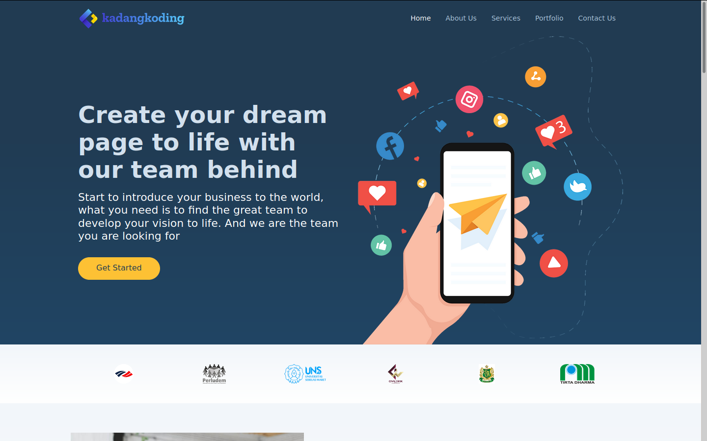

# Kadang Koding Re-design (Intern Project)

### Introduce

**Kadang Koding Indonesia** is a company with a focus on the digital industry, especially in the field of services and software trading. CV. Kadang Koding Indonesia was founded in 2018. Located in Surakata



## Prerequiste

-   [Composer](https://getcomposer.org/) - Download and Install Composer

### Installation

Install the dependencies and start the server.

```sh
$ git clone https://github.com/Zainal21/kadang-koding-backend.git
$ cd kadang-koding.com
$ composer install
$ cp .env.example to .env
$ change setting for database & generate key with php artisan key:generate
$ Call Action to Migrate Database & seeder with php artisan migrate --seed
$ php artisan serve
```

---

### The Project is MIT licensed.

Built with [Laravel](laravel.com/). Develop by [Muhamad Zainal Arifin](muhammadzaindev.vercel.app/)

---

2020 © Muhamad Zainal Arifin
